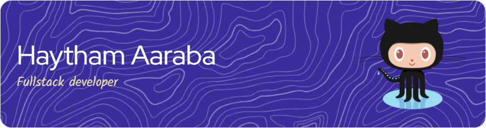

# 🙌 The story behind me 🙌

Hey👋. I'm Haytham, a passionate computer science student with a huge enthusiasm for coding 💻 and problem-solving 🔧.

Since my early years, I've been captivated by computers and technology 💻, spending countless hours ⏳ exploring software and hardware 💾. This childhood passion has ignited 🔥 a lifelong fascination with the field, continuing to fuel my journey in computer science 🚀.

It all started with learning about data structure and algorithm 📊, driven by my curiosity to understand how the code works. I then ventured into the fancy world of web development and design 🌐, exploring both worlds of backend and frontend development 🖥️. Now, I'm landing on the planet of artificial intelligence🤖, admiring the enormous power of the machines and their huge impact on today's world 🌍.

Ultimately, this GitHub portfolio is more than just a collection of code—it's a reflection of my journey as a computer science student and aspiring software engineer 👨‍💻.

# 💡 Skills and Interests 💡
### 🌐 Web Development 🌐
I am incredibly passionate🔥 about web development💻. The endless opportunities to create interactive and visually appealing digital experiences excite me💡. Each line of code feels like a chance to turn ideas into reality, combining creativity🎨 with technical skills🛠️. Whether I'm designing user interfaces or improving backend systems, the dynamic nature of web development keeps me engaged🚀. Every project presents a chance to learn, innovate💡, and contribute to the ever-changing online world🌐.
### 📊 Data Science 📊
  The idea of delving into vast datasets and extracting meaningful insights ignites a new level of excitement within me🔍. Just as with web development💻, I see endless possibilities in Data Science to uncover hidden patterns and make impactful discoveries💡. From analyzing customer behavior to predicting market trends📈, the potential applications fascinate me🌟. With each step forward in my journey, I am eager to immerse myself further into the world of data analysis and machine learning🧠, driven by a big desire to make a difference through data-driven insights🚀.

# 🔧 Languages and Technologies 🔧
### 🖥️ Frontend 🖥️
 
### 🛠️ Backend 🛠️
  
### 💾 Databases 💾
 
### 💻 Native languages 💻
   
### 🧬 Data science 🧬
  

 
